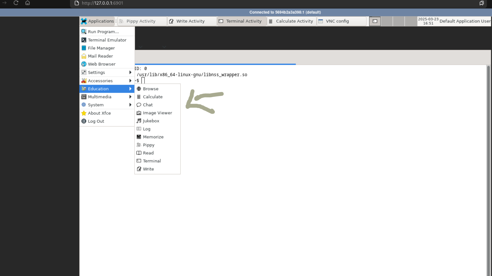

# Sugar VM Web

A headless VNC container running Sugar Desktop Environment on Debian.

## About

This project provides a Docker container with Sugar Desktop Environment and activities, accessible via VNC or a web browser (noVNC). It's built on Debian 12.

## Quick Start

### Build the Docker Image

```bash
# Build the Sugar XFCE image
docker build -t sugar-vm-web -f Dockerfile.sugar.xfce .
```

## Run the Container

```sh
# Run with default settings
docker run -d -p 5901:5901 -p 6901:6901 sugar-vm-web

# Run with custom VNC password
docker run -d -p 5901:5901 -p 6901:6901 -e VNC_PW=mypassword sugar-vm-web

# Run with custom resolution
docker run -d -p 5901:5901 -p 6901:6901 -e VNC_RESOLUTION=1920x1080 sugar-vm-web
```

## Accessing the Desktop

### VNC Viewer

Connect with any VNC viewer using:

- **Address**: localhost:5901 (or your server IP)
- **Password**: vncpassword (default, customize with VNC_PW)

### Web Browser

- **URL**: http://localhost:6901/ (or your server IP)
- **Password**: vncpassword (default, customize with VNC_PW)

## Configuration Options

### Environment Variables

| Variable | Default | Description |
|----------|---------|-------------|
| VNC_PW | vncpassword | Password for VNC connections |
| VNC_RESOLUTION | 1280x1024 | Screen resolution |
| VNC_COL_DEPTH | 24 | Color depth |
| VNC_VIEW_ONLY | false | Set to true for view-only mode |


## Credits

Inspired by https://github.com/ConSol/docker-headless-vnc-container/tree/master.

Thank you for the Ideation and the Code used. 
Credits for Source is the linked repository.


## Sugar Activities


```dockerfile
# Create a desktop shortcut for sugar activities
RUN mkdir -p $HOME/Desktop && \
    echo "[Desktop Entry]\n\
Type=Directory\n\
Name=Sugar Activities\n\
Icon=sugar\n\
Categories=Education;" > $HOME/Desktop/sugar-activities.directory
```
Add the following category:




The following Sugar activities are pre-installed:


- Browse (web browser)
- Calculate (calculator)
- Chat
- Image Viewer
- Jukebox (music player)
- Log
- Pippy (Python programming)
- Read (document reader)
- Terminal
- Write (text editor)

Note: Planning to add more sooon

